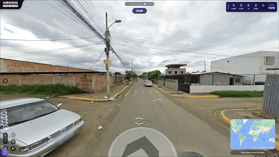

<div align="center">

# 🌍 GeoGuessr Assistant

**Определение локации раунда GeoGuessr в реальном времени — через CDP, без инжектов в процесс, полностью автоматически.**

[](https://python.org)
[](https://flask.palletsprojects.com)
[](https://leafletjs.com)
[](https://chromedevtools.github.io/devtools-protocol/)
[](LICENSE)

*Пока ты ещё ищешь дорожный знак — ассистент уже знает страну.*

<!-- Замени на реальный GIF работы ассистента -->


</div>

---

## ⚡ Что это

Локальный инструмент-компаньон, который определяет **точную локацию раунда GeoGuessr в реальном времени** и показывает её на живой карте рядом с игрой. Никаких прокси для пакетов, никаких инжектов DLL, никакого захвата окна — он общается с браузером через официальный **Chrome DevTools Protocol** и читает то, что игра сама уже знает.

| | |
|---|---|
| 🎯 **Задержка определения** | ~0–500 мс от начала раунда |
| 🧠 **Методы извлечения** | 7 независимых векторов (см. ниже) |
| 🗺️ **Фронтенд** | Leaflet, 5 провайдеров тайлов, тёмная тема |
| 📌 **5K-маркер** | Ставит метку прямо на игровую карту догадок |
| 🔌 **Подключение** | WebSocket уровня браузера, авто-аттач ко всем таргетам |

---

## 🔍 Как это работает

```
┌─────────────────────┐         CDP / WebSocket          ┌──────────────────────┐
│   Браузер Steam     │◄───────────────────────────────► │      main.py         │
│ (remote debugging)  │    Target.setAutoAttach          │   Flask + CDP-хаб    │
│                     │                                  │                      │
│  Вкладка GeoGuessr  │   ┌──────────────────────────┐   │  • Сниффер сети      │
│  ┌───────────────┐  │   │  INJECTION_SCRIPT (JS)   │   │  • Слушатель консоли│
│  │ fetch/XHR hook│──┼──►│  Хуки Google Maps API    │◄──┼──│  • JS-эвалюатор     │
│  │ StreetView API│  │   │  Сканер React-fiber      │   │  • Резолвер panoId   │
│  │ React state   │  │   │  Перехват img.src        │   │                      │
│  └───────────────┘  │   └──────────────────────────┘   │  /api/* эндпоинты    │
└─────────────────────┘                                  └──────────┬───────────┘
                                                                    │ HTTP :5000
                                                         ┌──────────▼───────────┐
                                                         │    static/index.html │
                                                         │  Карта Leaflet + UI  │
                                                         │  Обратный геокодинг  │
                                                         │  История раундов     │
                                                         └──────────────────────┘
```

### Векторы определения

Ассистент никогда не полагается на один источник. Если один не сработал — поймает другой:

1. **Перехват сети** — ответы GeoGuessr API и Google-эндпоинтов сканируются на пары `lat/lng`
2. **Хуки `fetch` / `XMLHttpRequest`** — зеркалирование запросов внутри страницы
3. **Хуки Google Maps API** — `StreetViewPanorama.setPosition()`, `setPano()`, `StreetViewService.getPanorama()` оборачиваются на месте
4. **panoId → координаты** — panoId извлекаются из URL тайлов Street View и резолвятся через собственный StreetViewService игры
5. **Скан React-fiber** — обход дерева компонентов в поисках объектов `location` в state/props
6. **Периодический опрос панорам** — прямой `getPosition()` у захваченных панорам
7. **Релей через консоль** — инжектированный скрипт репортит состояние через console-события обратно в бэкенд

---

## 🚀 Быстрый старт

### 1. Запусти игру с дебаг-портом

Steam → GeoGuessr → ПКМ → **Свойства** → **Параметры запуска**:

```
--remote-debugging-port=9222
```

### 2. Запусти ассистента

```bash
git clone https://github.com/therample/GG-Assistant.git
cd GG-Assistant
python main.py
```

Зависимости ставятся сами при первом запуске (Flask, websocket-client, requests, flask-cors).

### 3. Играй

Открой **http://localhost:5000** — всё. Начни раунд, карта найдёт тебя раньше, чем ты найдёшь подсказку.

---

## ⌨️ Горячие клавиши

| Клавиша | Действие |
|:---:|--------|
| `5` | Поставить 5K-маркер на **игровую** карту догадок |
| `S` | Показать текущую локацию на карте ассистента |
| `C` | Скопировать координаты |
| `A` | Скопировать полный адрес |
| `G` | Повторно определить место |
| `Shift` + кнопка `5K` | Убрать маркеры из игры |

---

## 🔧 API

Бэкенд поднимает простой REST-интерфейс:

| Эндпоинт | Метод | Описание |
|----------|:------:|-------------|
| `/api/status` | `GET` | Состояние подключения, приаттаченные таргеты |
| `/api/location` | `GET` | Локация текущего раунда, panoId, номер раунда, источник |
| `/api/reverse-geocode` | `GET` | Определение страны/города через Nominatim |
| `/api/place-5k` | `POST` | Поставить маркер на игровую карту |
| `/api/clear-5k` | `POST` | Убрать маркеры из игры |

---

## 🗺️ Провайдеры тайлов

Dark Matter · CartoDB Voyager · OpenStreetMap · Спутник Esri · OpenTopoMap

Для CARTO-тайлов нужен бесплатный API-ключ — получи на [carto.com](https://carto.com/) и впиши в `static/app.js`:

```js
cartoApiKey: 'ВАШ_КЛЮЧ_CARTO',
```

---

## 📁 Структура проекта

```
GG-Assistant/
├── main.py              # CDP-хаб, снифферы, логика инжекта, Flask API
└── static/
    ├── index.html       # Разметка UI
    ├── app.js           # Фронтенд: Leaflet, опрос API, настройки
    └── style.css        # Тёмная тема, анимации, золотая кнопка 5K
```

---

## ⚠️ Дисклеймер

Проект создан в исследовательских и образовательных целях — как изучение Chrome DevTools Protocol, инструментов браузерной инструментации и техник извлечения данных в реальном времени. Использование в рейтинговых мультиплеерных играх нарушает Terms of Service GeoGuessr. Ответственность за использование — на тебе.

---

## 📜 Лицензия

MIT — см. [LICENSE](LICENSE).

<div align="center">
<sub>GGAssistant</sub>
</div>
